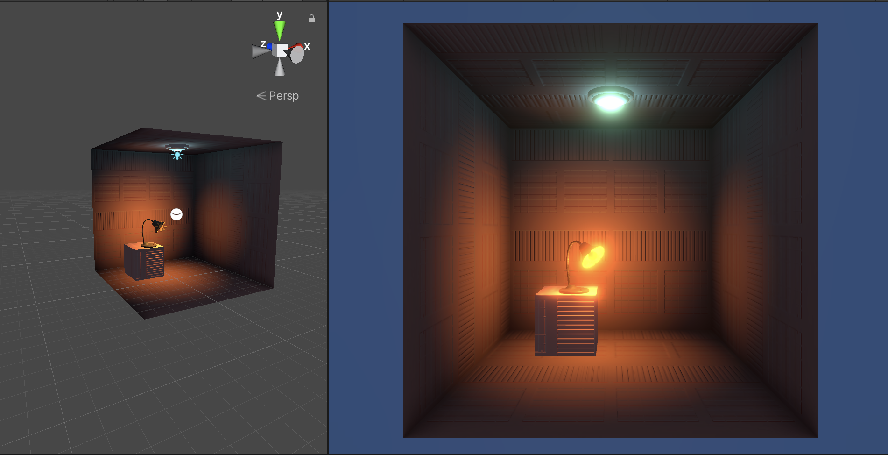

# ProgrammingFor3D
Programming For 3D Assignment 1 in Unity

## Lab 1 - W1S1

- Created new project
- Added to GitHub
- Created walls with planes
- Added ceiling lamp preset
  - Added point light

## Lab 2 - W1S2 - 08-10-2021 

- Added material to walls
- Added Box
- Added Lamp with bulb (with point light)
- Added Bloom to main camera
- Added Reflection Probe

## Lab 3

<video src="readme pics/Screen Recording 2021-10-11 at 11.07.25.mov"></video>
